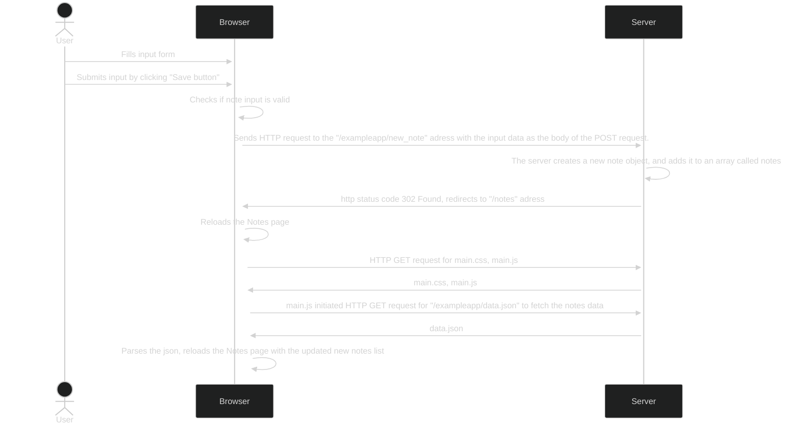

```mermaid
---
config:
  theme: dark
---
sequenceDiagram
    actor User
    participant Browser
    participant Server
    User->>+Browser: Fills input form
    User->>+Browser: Submits input by clicking "Save button"
    Browser->>+Browser: Checks if note input is valid
    Browser->>+Server: Sends HTTP request to the "/exampleapp/new_note" adress with the input data as the body of the POST request.
    Server->>+Server: The server creates a new note object, and adds it to an array called notes
    Server->>+Browser: http status code 302 Found, redirects to "/notes" adress
    Browser->>+Browser: Reloads the Notes page
    Browser->>+Server: HTTP GET request for main.css, main.js
    Server->>+Browser: main.css, main.js

    Browser->>+Server: main.js initiated HTTP GET request for "/exampleapp/data.json" to fetch the notes data
    Server->>+Browser: data.json
    Browser->>+Browser: Parses the json, reloads the Notes page with the updated new notes list
```
