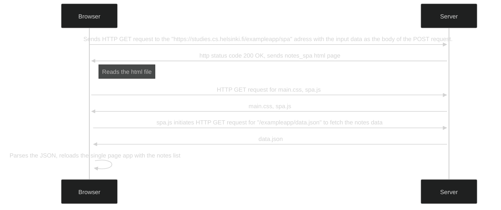

```mermaid
---
config:
  theme: dark
---
sequenceDiagram
    participant Browser
    participant Server
    Browser->>+Server: Sends HTTP GET request to the "https://studies.cs.helsinki.fi/exampleapp/spa" adress with the input data as the body of the POST request.
    Server->>+Browser: http status code 200 OK, sends notes_spa html page
    Note right of Browser: Reads the html file
    Browser->>+Server: HTTP GET request for main.css, spa.js
    Server->>+Browser: main.css, spa.js

    Browser->>+Server: spa.js initiates HTTP GET request for "/exampleapp/data.json" to fetch the notes data
    Server->>+Browser: data.json
    Browser->>+Browser: Parses the JSON, reloads the single page app with the notes list
```
