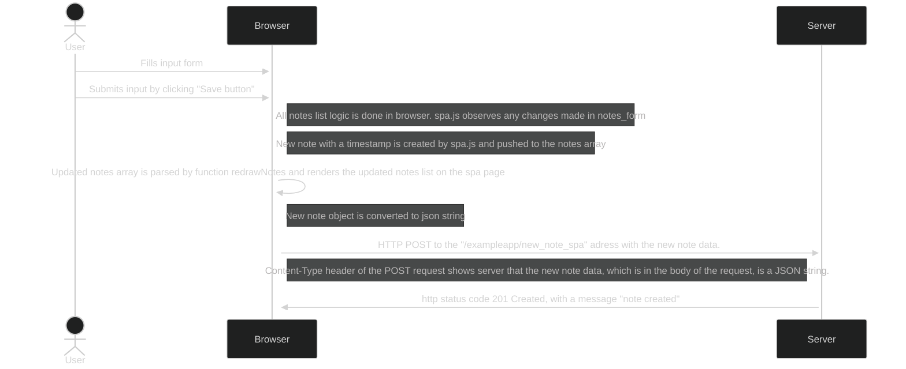

```mermaid
---
config:
  theme: dark
---
sequenceDiagram
    actor User
    participant Browser
    participant Server
    User->>+Browser: Fills input form
    User->>+Browser: Submits input by clicking "Save button"
    Note right of Browser: All notes list logic is done in browser. spa.js observes any changes made in notes_form
    Note right of Browser: New note with a timestamp is created by spa.js and pushed to the notes array
    Browser->>+Browser: Updated notes array is parsed by function redrawNotes and renders the updated notes list on the spa page
    Note right of Browser: New note object is converted to json string
    Browser->>+Server: HTTP POST to the "/exampleapp/new_note_spa" adress with the new note data.
    Note left of Server: Content-Type header of the POST request shows server that the new note data, which is in the body of the request, is a JSON string.
    Server->>+Browser: http status code 201 Created, with a message "note created"
```
